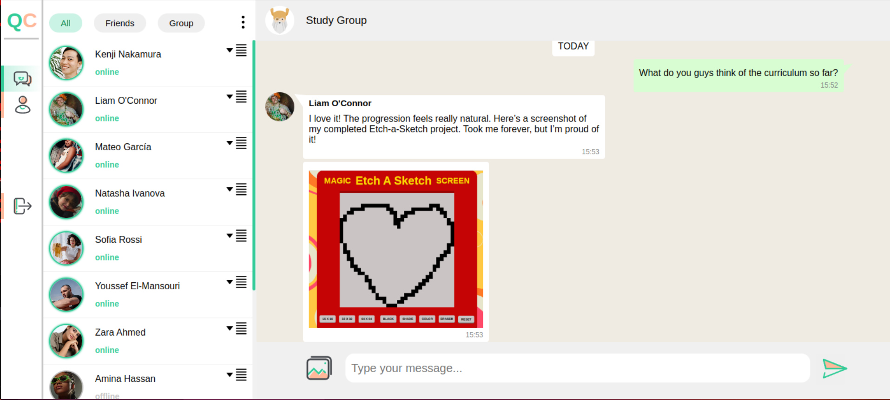

# messaging-app

Real-time messaging app to put into practice everything I learned during <a href="https://www.theodinproject.com/" target="_blank">The Odin Project course</a>

<a href="https://frontend-messaging-app.netlify.app/authentication-page" target="_blank">Link to the app website</a>

<h2>Features:</h2>

<ul>
    <li>Registration and login</li>
    <li>See if a user is online/offline</li>
    <li>Real-time messaging</li>
    <li>Send images</li>
    <li>Add/Remove a user from your friends list</li>
    <li>Create/delete or leave a group</li>
    <li>Customize your profile picture</li>
    <li>Responsive design for mobile devices</li>
</ul>

<h2>Technology used:</h2>

<ul>
    <li>HTML</li>
    <li>CSS</li>
    <li>JavaScript</li>
    <li>React</li>
    <li>Node.js</li>
    <li>Express</li>
    <li>MongoDB</li>
    <li>Mongoose</li>
    <li>Cloudinary</li>
    <li>Socket.io</li>
    <li>Passport.js</li>
</ul>

<h2>Cloud hosting platforms</h2>

<ul>
    <li>Frontend <a href="https://www.netlify.com/" target="_blank">Netlify</a></li>
    <li>Backend <a href="https://fly.io/" target="_blank">Fly.io</a></li>
</ul>

<h2>Credit:</h2>

<h3>SVG</H3>
<ul>
    <li><a href="https://www.svgrepo.com/svg/449958/user" target="_blank">Default user image</a></li>
    <li><a href="https://www.svgrepo.com/svg/361482/dropdown-menu" target="_blank">User dropdown menu</a></li>
    <li><a href="https://www.svgrepo.com/svg/530377/chat-chat" target="_blank">Sidebar chat</a></li>
    <li><a href="https://www.svgrepo.com/svg/530387/personal-account-account" target="_blank">Sidebar user profile</a></li>
    <li><a href="https://www.svgrepo.com/svg/530396/upload" target="_blank">Sidebar logout</a></li>
    <li><a href="https://www.svgrepo.com/svg/506247/menu-vertical" target="_blank">Three dots dropdown menu</a></li>
    <li><a href="https://www.svgrepo.com/svg/435541/user-ok" target="_blank">Add user to group</a></li>
    <li><a href="https://www.svgrepo.com/svg/295320/checkmark" target="_blank">Checkmark</a></li>
    <li><a href="https://www.svgrepo.com/svg/530379/pencil-revision" target="_blank">Edit info</a></li>
    <li><a href="https://www.svgrepo.com/svg/530373/camera-take-pictures" target="_blank">Edit photo</a></li>
    <li><a href="https://www.svgrepo.com/svg/530392/picture" target="_blank">Attach photo to message</a></li>
    <li><a href="https://www.svgrepo.com/svg/194079/paper-plane" target="_blank">Send message</a></li>
</ul>

<h3>Profile image</H3>
<ul>
    <li><a href="https://www.pexels.com/it-it/foto/moda-occhiali-da-sole-donna-testa-9771804/" target="_blank">Amina Hassan</a></li>
    <li><a href="https://www.pexels.com/it-it/foto/uomo-persona-erba-secca-camicia-bianca-6418928/" target="_blank">Arjun Patel</a></li>
    <li><a href="https://www.pexels.com/it-it/foto/uomo-persona-faccia-felice-5506143/" target="_blank">Kenji Nakamura</a></li>
    <li><a href="https://www.pexels.com/it-it/foto/uomo-vacanza-festivo-alcol-7084589/" target="_blank">Liam O'Connor</a></li>
    <li><a href="https://www.pexels.com/it-it/foto/donna-smartphone-cellulare-cuffie-7651732/" target="_blank">Lin Zhang</a></li>
    <li><a href="https://www.pexels.com/it-it/foto/uomo-persona-arte-graffiti-8009948/" target="_blank">Mateo García</a></li>
    <li><a href="https://www.pexels.com/it-it/foto/donna-cappello-ritratto-sorridente-9937867/" target="_blank">Natasha Ivanova</a></li>
    <li><a href="https://www.pexels.com/it-it/foto/pasta-sorriso-sorridere-femmina-10049152/" target="_blank">Sofia Rossi</a></li>
    <li><a href="https://www.pexels.com/it-it/foto/uomo-seduto-fitness-tiro-verticale-6822274/" target="_blank">Youssef El-Mansouri</a></li>
    <li><a href="https://www.pexels.com/it-it/foto/donna-giovane-sorriso-sorridere-9822974/" target="_blank">Zara Ahmed</a></li>
</ul>
